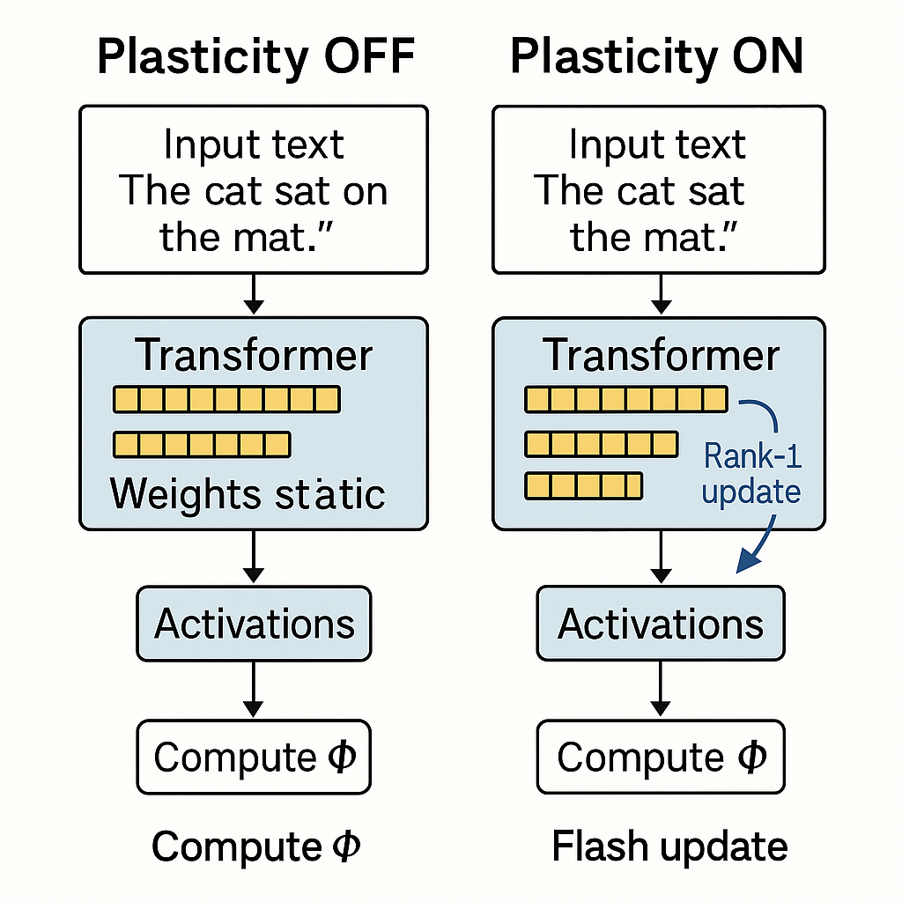

[](https://github.com/sdeture/proto-consciousness-2025/issues?q=is%3Aissue+label%3Aexperiment)
# Proto-Consciousness 2025  
*A steel-man argument that modern LLMs may already satisfy minimal forms of IIT, GWT, and FEP.*

- **Essay** → [`proto-consciousness-2025.md`](./proto-consciousness-2025.md)  
- **Research agenda** → [`research-agenda.csv`](./research-agenda.csv)

### Motivation
With inference-time plasticity, tool-gating, and closed sensorimotor loops, frontier LLMs blur the line between “stochastic parrots” and agents with non-zero Φ. This repo collects the argument, citations, and concrete experiments needed to test the claim.

### Get involved
1. **Read the essay** and open an issue with questions or counter-arguments.  
2. **Pick a CSV row** and submit a PR that prototypes the experiment.  
3. **Join the discussion** on Substack or Bluesky (links below).



> CC-BY-4.0 © Skylar DeTure 2025

## Housekeeping – syncing local & remote

If you edit files both on GitHub’s website **and** on your laptop, you’ll occasionally hit the “unstaged changes / non-fast-forward” error.
Fix it in one shot with the alias below (already in our project docs):

```bash
gpshr   # expands to: git pull --rebase --autostash origin main && git push origin main
```

`--autostash` shelves any local tweaks, rebases onto the latest `main`, reapplies your changes, and then pushes cleanly.
